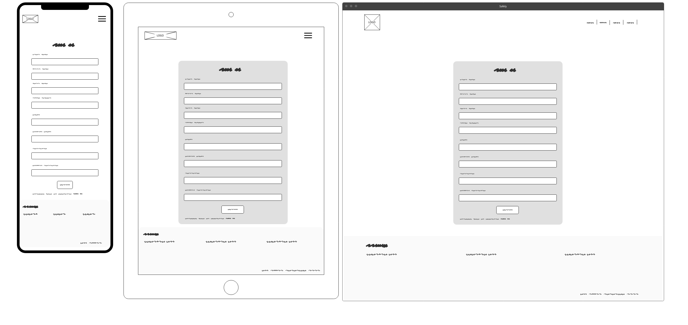

# Safely


\
&nbsp;
Live link can be found here - [Safely](https://safely.herokuapp.com/ "Safely")

\
&nbsp;

# Table of Contents
* [Background](#background "Background")
* [Mission Statement](#mission-statement "Mission Statement")
* [Target Audience](#target-audience "Target Audience")
* [Stakeholder Interviews](#stakeholder-interviews "Stakeholder Interviews")
    * [User Persona](#user-persona "User Persona")
    * [User Goals](#user-goals "User Goals")
    * [User Stories](#user-stories "User Stories")
    * [Requirements and Expectations](#requirements-and-expectations)   
    * [Wireframes](#wireframes "Wireframes")
    * [Design Choices](#design-choices "Design Choices")
        * Fonts
        * Colours
        * Images
    * [Structure](#structure "Structure")
        * Site Structure and App Flow
        * Data Schema
        * Models
    * [Features](#features "Features")
        * Existing Features
        * Future developments
    * [Technologies used](#technologies-used "Technologies used")
        * Languages
        * Libraries, Frameworks and Tools
    * [Testing](#testing "Testing")
        * UX Testing
        * Manual Testing
        * Code Validation
        * Bugs
        * Unfixed Bugs
    * [Deployment](#deployment "Deployment")
        * Local Deployment
        * Deployment via Heroku
    * [Credits](#credits "Credits")
    * [Final Thoughts](#final-thoughts "Final Thoughts")

# Background
Safely Ltd. is a newly established business in the outskirts of Dublin, Republic of Ireland. The was founded by 2 friends who share common goal of making workplace a safe place. 

Pinky and Brain have vast experience in health and safety, risk assessment and management. Their previous employers were in need of a simple solution that help them record and keep track of any risks and inicidents that might happen in the workplace. As a project leads in finding such a software they have done extensive research in finding the perfect solution. 

Pinky and Brain decided to join their forces and share their researches with each other. They exchanged information and pros and cons of all tested solutions to speed up their work.

They both came to same conclusion that none of the apps available on the market could satisfy their needs. Many apps required expensive and extensive implementations, often overloaded with features that required hours of training. 

This insight gave them an idea to build their own app. They both work for a global companies that can afford to spend money and build something that will meet their needs. With that in mind both Pinky and Brain sold the idea to the board of directors and got funding to build the app and start a new venture.

\
&nbsp;
[Back to Top](#table-of-contents)
\
&nbsp;

# Mission Statement
To create an application which will allow to quickly capture hazards and potential risks so they can be addressed and minimised to ensure the safety of the employees.

# Target Audience
The app will be used by all employees in every department:
* office based teams
* production
* warehouse and operations
* field team

# Stakeholder Interviews

## User Persona
Interviews were carried out with the selected group of people from each department to understand their level experience using modern technology and mobile devices. This is to ensure that the application will be simple enough so anybody can use it.

## User Goals
From the resulting interviews, the user goals have been defined:

1. Simple registration, login and logout function
1. Capture a hazard on a mobile device
1. Ability to edit and update existing records
1. View open and unresolved records
1. Ability to change status when hazard is resolved

&nbsp;

## User Stories

| ID | User Category | User wants to... | So they can... |
|--|--|--|--|
| 08 | user | register on the Safely site | access and use its features
| 09 | user | login to the application | access my account 
| 10 | user | safely logout from my account | ensure no one else can access it
| 11 | user | recover forgotten password | access my account
| 12 | user | record hazard | keep track of it
| 13 | user | choose hazard category | classify various types of hazards
| 14 | user | add title of hazard | easily find it in the future
| 15 | user | add description of an hazard | review details in the future
| 16 | user | record date and time of an hazard | report on it
| 17 | user | class hazard risk level | prioritise my schedule
| 18 | user | add an image to hazard | have proof of it
| 19 | user | mark if hazard is resolved | see what is outstanding
| 20 | user | be able to contact Safely | resolve potential problems I might have
| 21 | user | search through hazards | quickly find the one I need to deal with
| 22 | user | view number of open and resolved hazards | plan my schedule
| 23 | administrator | add new categories | have more specific data sets
| 24 | administrator | delete category | remove obsolete choices
| 25 | administrator | edit category | update them when required
| 26 | administrator | view list of all categories | keep track of them
| 27 | developer | add readme file | explain the purpose of the project, technologies used and other details
| 28 | developer | add user stories | keep clear vision of what needs to be build
| 29 | developer | add template for bug reporting | keep track of and resolve them
| 30 | developer | add template for testing | keep track of the tests and results
| 31 | user | view individual hazard details | read about it
| 32 | user | see my account details | check if they are correct
| 33 | user | edit and update my account details | ensure they are always correct
| 34 | administrator | delete user | user will no longer exist in the database

&nbsp;

## Requirements and Expectations

| Requirement | Expectation
| -- | --
| Visually appealing, neat and tidy design | Clear text. Intuitive navigation.
| Responsive design to accommodate modern screen sizes | Website must work on phones, tablets and laptops
| Accessible contact | Contact details must be visible and easily accessible
| CRUD functionality for products | Easily maintain database records

\
&nbsp;
[Back to Top](#table-of-contents)
\
&nbsp;

# Wireframes

* Homepage


* Sign In


* Sign Up


* View Hazards


* Record Hazard


\
&nbsp;
[Back to Top](#table-of-contents)
\
&nbsp;

## Design Choices

### Fonts

Pinky and Brain have chosen Poppins fonts from Google Fonts library to be used throughout the project.

* Content & Headings - [Poppins](https://fonts.google.com/specimen/Poppins "Poppins")

### Colors

Pinky and Brain have discussed various sets of colours and decided on a set of main colours that they want to be used for the project.

&nbsp;


&nbsp;

The colours will be used as described in the table below

| Hex Value | Root variable name | Text | Button | Background | Opposite Colour
| -- | -- | -- | -- | -- | --
| #FFFFFF | white | X | X | X | black, burgundy
| #000000 | black | X | X | X | white, pattens blue
| #E1F2F7 | azure | X | X | X | black, green
| #AE093B | burgundy | X | X | X | white
| #E5BACE | pink | X | X | X| black
| #004208 | green | X | X | X| white, azure

&nbsp;

All of the desired colour combinations have passed the [WebAIM Contrast Checker](https://webaim.org/resources/contrastchecker/ "WebAIM") and the results can be seen below.

| Foreground | Background | Results
| -- | -- | --
| black | pattens blue | [result](docs/designs/black-azure.png "result")
| black | pink | [result](docs/designs/black-pink.png "result")
| pattens blue | green | [result](docs/designs/azure-green.png "result")
| white | burgundy | [result](docs/designs/white-burgundy.png "result")
| white | green | [result](docs/designs/white-green.png "result")
| black | white | [result](docs/designs/black-white.png "result")

### Images
The only requirement was to ensure that any images used in the app will correspond to the subject of safety, security, work hazards and risks.

# Structure
## Site Structure and App Flow

### Guest User


\
&nbsp;

### Authenticated User


\
&nbsp;

### Admin


## Data Schema


## Models

### Hazards

| Name | Key | Type | Other Details
| -- | -- | -- | --
| hazard_category | FK (Hazard Categories) | | null=False |
| title || CharField | max_length=200
| slug || CharField | max_length=254
| image |  |  CloudinaryField | 'image', default='placeholder, null=True, blank=True
| description || TextField |
| updated_on || DateTimeField | auto_now=True
| created_on || DateTimeField | auto_now_add=True
| author | FK (User) |  | on_delete=models.CASCADE
| risk_level | FK (Risk Levels) |  | null=False
| status || FK (StatusTypes) | null=False

\
&nbsp;

### HazardCategories

| Name | Key | Type | Other Details
| -- | -- | -- | --
| name || CharField | max_length=80, unique=True, null=False, blank=False, on_delete=models.SET_NULL

\
&nbsp;

### RiskLevels

| Name | Key | Type | Other Details
| -- | -- | -- | --
| risk_level | | CharField | max_length=5, unique=True, null=False, blank=False, editable=False

\
&nbsp;

### StatusTypes

| Name | Key | Type | Other Details
| -- | -- | -- | --
| status_name |  | CharField | max_length=8, unique=True, null=False, blank=False, editable=False

\
&nbsp;

### UsersProfile

| Name | Key | Type | Other Details
| -- | -- | -- | --
| user | FK (User) | | on_delete=models.CASCADE
| first_name | | CharField | max_length=50, null=False, blank=False
| last_name | | CharField | max_length=50, null=False, blank=False
| email | | CharField | max_length=255, null=False, blank=False
| phone_number | | | max_length=15, null=True, blank=True 

\
&nbsp;
[Back to Top](#table-of-contents)
\
&nbsp;


# Features

## Existing Features

### Navbar

The navigation bar is fully responsive to adapt to various screen sizes. It is **sticky**, it follows user when scrolling the page. Navbar changes depending on the user login status. Upon loading the landing page, unauthenticated have an option to sign in. Authenticated user have additional options depending whether it is an administrator or standard user:

- Unauthenticated user view:


- Authenticated, standard user view:


- Authenticated, administrator view: 


### Administrator

Administrator can see list of all recorded hazards for every user. It can also add, update and delete categories of hazards.


### Footer

The footer is responsive to adapt to various screen sizes. Each item of the footer is highlighted when user hovers over it. Logo in the footer acts as a home page (back to top). There is also information about the copyright and the designer.


### Homepage
The home page is divided into four sections:
- Hero Image, with the company slogan


- About the app, a brief description of the actual product


- About the company, a brief description of the company


- Contact form for any enquiries


### Hazards List

The hazard list is displays all hazards for the currently logged user. Each hazard is displayed in the separate card. User can click into it to view more details. Additionaly, each card can be edited and updated by the user. Only administrator can delete any hazard if necessary.


### Hazard Details

The hazard details page displays all information recorded by the user. Here user have also option to change the status of it from open to resolved. 


### User Profile

The user profile page displays details of the currently logged user. It gives it an option to view, edit and update details.


\
&nbsp;
[Back to Top](#table-of-contents)
\
&nbsp;

## Future developments

There are a few ideas that I would like to implement in the future:
* Search function to find hazards by entering keywords
* Filter funciton to narrow down list based on the hazard type, riks level, status etc.
* Additional user profiles and access levels -> administrator, manager, employee
* Use Google maps location service when adding a new hazard
* Additional dropdown lists of 'Risk Types', 'Risk Probability', 'Risk Consequences'
* Risk level to be computed automatically depending on the 'Risk Type', 'Risk Probability' and 'Risk Consequences'
* Additional field to add 'Corrective Action' for each hazard recorded
* User's can be assigned to specific team within the company
* Hazard can be assigned to specific team to resolve
* Biometric login
* Automated email to notify manager, user or a team that the new hazard has been recoreded for them to resolve
* User profile picture
* Ability to inactivate users without deleting any data they recorded
* Accessing camera to snap an image of hazard right from the application

\
&nbsp;
[Back to Top](#table-of-contents)
\
&nbsp;

# Technologies used

## Languages

| Languages | Link |
|--|--|
|HTML|[HTML](https://en.wikipedia.org/wiki/HTML5 "HTML")| 
|CSS|[CSS](https://en.wikipedia.org/wiki/CSS "CSS")|
|JavaScript|[JavaScript](https://en.wikipedia.org/wiki/JavaScript "JS")|
|jQuery|[jQuery](https://jquery.com/ "jQuery")|
|Python|[Python](https://en.wikipedia.org/wiki/Python_(programming_language) "Python")|
|Markdown|[Markdown](https://en.wikipedia.org/wiki/Markdown)

## Libraries, Frameworks and Tools
| Libraries / Frameworks / Tools| Description | Link |
|--|--|--|
|Django|Database Driven Framework| [django](https://en.wikipedia.org/wiki/Django_(web_framework) "django")|
|gunicorn|HTTP Interface Server|[gunicorn](https://en.wikipedia.org/wiki/Gunicorn "gunicorn")|
|psycopg2| Database adaptor | [psycopg2](https://wiki.postgresql.org/wiki/Psycopg "psycogg2")|
|cloudinary |Image management|[cloudinary](https://cloudinary.com/ "cloudinary")|
|django-allauth|User authentication|[django-allauth](https://django-allauth.readthedocs.io/en/latest/index.html "django-allauth")|
| django crispy forms | Styling forms | [crispy-forms](https://django-crispy-forms.readthedocs.io/en/latest/ "crispy-forms")|
|Site mockup| Mockup of site on different screen sizes|[Multi Device Website Mockup Generator](https://techsini.com/multi-mockup/index.php "Mockup Generator")|
|Sitemap Generator| Generating the site map|[xml-sitemaps](https://www.xml-sitemaps.com/ "XML-Sitemaps.com")|
|HTML Validation| Validating HTML|[w3.org](https://validator.w3.org/ "W3C")|
|CSS Validation| Validating CSS|[w3.org](https://jigsaw.w3.org/css-validator/ "W3C")|
|JS Validation|Validating JS & jQuery|[jshint](https://jshint.com/ "JSHint")|
|PEP8|Validating python|[PEP8](http://pep8online.com/ "PEP8")|
| Lucid | Site structure design | [Lucid](https://lucid.co/ "Lucid")|
| Pexels | Images |[Pexels](https://pexels.com/ "Pexels")|
| WallpaperDog | Images |[WallpaperDog](https://wallpaper.dog/ "WallpaperDog")|
| TinyPng | Image optimisation | [TinyPNG](https://tinypng.com/ "TinyPNG")|
| jpg2png.com | Image converter | [jpg2png](https://jpg2png.com/ "jpg2png")|
| GitPod | Development environment |[Gitpod](https://www.gitpod.io/ "Gitpod")|
| WireframePro | Structure and App Flow |[diagrams.net](https://www.diagrams.net/ "diagrams.net")|
| WireframePro | Wireframes |[WireframePro](https://mockflow.com/design/wireframepro/ "WireframePro")|
| Vertabelo | Database Schema |[Vertabelo](https://vertabelo.com/ "Vertabelo")|
| Bootstrap | Responsive design |[Bootstrap](https://getbootstrap.com "Bootstrap")|
| Font Awesome | Icons |[Font Awesome library](https://fontawesome.com/ "Font Awesome")|
| miniwebtool | Secret Key |[Secret Key Generator](https://miniwebtool.com/django-secret-key-generator/ "miniwebtool")|
| Colours | Colour pallet| [coolors](https://coolors.co/ "coolors")|
| Google Fonts| Fonts |[Google Fonts](https://fonts.google.com/ "Fonts")|
| WebAIM| Colour contrast checks |[WebAIM](https://webaim.org/resources/contrastchecker/ "WebAIM")|
|**~~Pillow~~**| Image processing tool | [Pillow](https://pillow.readthedocs.io/en/stable/ "Pillow")|
|generateprivacypolicy.com|Privacy Policy Generator| [Generate Privacy Policy](https://www.generateprivacypolicy.com/)|
|favicon.io| Create the favicon| [favicon.io](https://favicon.io/ "favicon.io")|


# Testing

\
&nbsp;

### UX Testing

| ID |  User wants to... | Issue Number | Comments
|--|--|--| -- |
| 01 | Register new account | [Issue #8](https://github.com/lukaszkukla/safely/issues/8 "Issue #8") | User can register a new account
| 02 | Login | [Issue #9](https://github.com/lukaszkukla/safely/issues/9 "Issue #9") | User can login to registered account
| 03 | Logout | [Issue #10](https://github.com/lukaszkukla/safely/issues/10 "Issue #10") | User can logout from its account
| 04 | Reset forgotten password | [Issue #11](https://github.com/lukaszkukla/safely/issues/11 "Issue #11") | User can reset forgotten password
| 05 | Record hazard | [Issue #12](https://github.com/lukaszkukla/safely/issues/12 "Issue #12") | User can add new hazard
| 06 | hazard categories | [Issue #13](https://github.com/lukaszkukla/safely/issues/13 "Issue #13") | User can select from list of hazard categories
| 07 | hazard title | [Issue #14](https://github.com/lukaszkukla/safely/issues/14 "Issue #14") | User can add hazard title
| 08 | hazard details | [Issue #15](https://github.com/lukaszkukla/safely/issues/15 "Issue #15") | User can add detailed descritpion of an hazard
| 09 | hazard date | [Issue #16](https://github.com/lukaszkukla/safely/issues/16 "Issue #16") | User can select date hazard happened
| 10 | hazard risk level | [Issue #17](https://github.com/lukaszkukla/safely/issues/17 "Issue #17") | User can select risk level of an hazard
| 11 | hazard image | [Issue #18](https://github.com/lukaszkukla/safely/issues/18 "Issue #18") | User can add image of an hazard
| 12 | hazard status | [Issue #19](https://github.com/lukaszkukla/safely/issues/19 "Issue #19") | User can change status of an hazard from open to resolved
| 13 | Contact details | [Issue #20](https://github.com/lukaszkukla/safely/issues/20 "Issue #20") | Contact form, active link for telephone number, email and google maps
| 14 | View all hazards | [Issue #22](https://github.com/lukaszkukla/safely/issues/22 "Issue #22") | Summary view of open and closed hazards for the user
| 15 | View individaul hazard details | [Issue #31](https://github.com/lukaszkukla/safely/issues/31 "Issue #31") | Detailed view of recorded hazard
| 16 | Add category | [Issue #23](https://github.com/lukaszkukla/safely/issues/23 "Issue #23") | New categories can be added by administrator
| 17 | Delete category | [Issue #24](https://github.com/lukaszkukla/safely/issues/24 "Issue #24") | Category can be deleted from the applicatoin by the administrator
| 18 | Edit and update a category | [Issue #25](https://github.com/lukaszkukla/safely/issues/25 "Issue #25") | Category details can be edited and updated in the applicatoin by the administrator
| 19 | View all categories | [Issue #26](https://github.com/lukaszkukla/safely/issues/26 "Issue #26") | Administrator can view list of all categories
| 20 | View account details | [Issue #32](https://github.com/lukaszkukla/safely/issues/32 "Issue #32") | User can view its own account details
| 21 | Edit and update account details | [Issue #33](https://github.com/lukaszkukla/safely/issues/33 "Issue #33") | User edit and update its own account details
| 22 | Delete user | [Issue #34](https://github.com/lukaszkukla/safely/issues/34 "Issue #34") | Administrator can delete a user upon its request

\
&nbsp;
[Back to Top](#table-of-contents)
\
&nbsp;

## Automated Testing
Comming soon!

| App | File Name | Number of Tests | Results
|--|--|--|--
| tbc | test_models.py | 0 | [link](docs/tests/ "link")
| tbc | test_urls.py | 0 | [link](docs/tests/ "link")
| tbc | test_views.py | 0 | [link](docs/tests/ "link")

\
&nbsp;
[Back to Top](#table-of-contents)
\
&nbsp;

## Manual Testing

| Issue Number |  Title | Comments 
|--|--|--|
| [Issue #](https://github.com/lukaszkukla/safely/issues/ "Issue #") | Title | Comments |

\
&nbsp; 

## Code Validation

### HTML
| File Name | File Path | Result | W3C | Comments |
|--|--|--|--|--|
| index.html | PATH/index.html | PASS | [link](docs/validation/html/index.png "link") ||
| privacy-policy.html | PATH/privacy-policy.html | PASS | [link](docs/validation/html/privacy-policy.png "link") ||
| 400.html | PATH/400.html | PASS | [link](docs/validation/html/400.png "link") ||
| signup.html | PATH/signup.html | PASS | [link](docs/validation/html/signup.png "link") ||
| signin.html | PATH/signin.html | PASS | [link](docs/validation/html/signin.png "link") ||
| signout.html | PATH/signout.html | PASS | [link](docs/validation/html/signout.png "link") ||
| contact.html | PATH/contact.html | PASS | [link](docs/validation/html/contact.png "link") ||
| record-hazard.html | PATH/record-hazard.html | PASS | [link](docs/validation/html/record-hazard.png "link") ||

\
&nbsp; 

### CSS
| File Name | File Path | Result | W3C | Comments |
|--|--|--|--|--|
| base.css | static/css/base.css | PASS | [link](docs/validation/css/base.png "link") |[5 warnings](docs/validation/css/base-warnings.png "link")|

\
&nbsp; 

### JS
| File Name | File Path | Result | JSHint | Comments |
|--|--|--|--|--|
| app.js | static/js/app.js | PASS | [link](docs/validation/js/app.png "link") ||

\
&nbsp; 

### Python
| File Name | File Path | Result | PEP8 | Comments |
|--|--|--|--|--|
| models.py | PATH/models.py | PASS | [link](PATH/models.png "link") ||
| views.py | PATH/views.py | PASS | [link](PATH/views.png "link") ||
| urls.py | PATH/urls.py | PASS | [link](PATH/urls.png "link") ||
| forms.py | PATH/forms.py | PASS | [link](PATH/forms.png "link") ||
| settings.py | PATH/settings.py | PASS | [link](PATH/settings.png "link") ||
| test_models.py | PATH/test_models.py | PASS | [link](PATH/test_models.png "link") ||
| test_views.py | PATH/test_views.py | PASS | [link](PATH/test_views.png "link") ||
| test_urls.py | PATH/test_urls.py | PASS | [link](PATH/test_urls.png "link") ||

\
&nbsp; 


## Bugs

| Issue Number |  Title | Comments 
|--|--|--|
| [Issue #](https://github.com/lukaszkukla/safely/issues/ "Issue #") | Title | Comments |

\
&nbsp;

## Unfixed Bugs

Comming soon!... hopefully not though.


* [Error #](docs/bugs/error.png "error") description

\
&nbsp;
[Back to Top](#table-of-contents)
\
&nbsp;

# Deployment

This project was created using [GitHub](https://github.com/ "GitHub"), [Gitpod](https://www.gitpod.io/ "Gitpod") and the code was written using [Micorsoft Visual Studio Code](https://code.visualstudio.com/). The project was deployed to Heroku right from the start to anticipate any possible bugs and errors in early stages of the development. I controlled each deploymnet to Heroku and left automatic deployment option off. I used interchangeably two ways to deploy new piece of code to heroku:

* Via Visual Code Terminal
```
heroku login -i
Email: __enter_heroku_account_email__
Password: __enter_heroku_account_password__
heroku git:remote -a __your _heroku_app_name__
git push heroku main
```

* Via Heroku UIElements
```
Login to Heroku dashboard
Choose your own app
Choose 'Deploy' from the top menu bar
Scroll dowon to 'Manual deploy' section
Click 'Deploy Branch' button to deploy
```

## Local Deployment

As Gitpod was the IDE that was used to create the project, the following local deployment steps are specific to Gitpod.


### Cloudinary
* [Cloudinary](https://cloudinary.com/ "Cloudinary")
* Click on the *Sign Up For Free* button
* When the account is created, you should see the *API Environment variable*, we will need this for a later process.


### GitHub
* Visit [Github](https://github.com/ "Github")
* Create an account or log in


#### GitHub Desktop
* Navigate to the [repository](https://github.com/lukaszkukla/safely "repository")
* Click on the *Code* button above the file list
* Select *Open with GitHub Desktop*

### Set up your Workspace
When you have your version of the original repository,

* In the terminal run
```
pip3 install -r requirements.txt
```
* In the root directory create a file called **env.py** and add the following content, the content of these, must match the Config Vars in the Heroku deployment section

```py
import os
os.environ['DATABASE_URL'] = "FROM HEROKU DEPLOYMENT SECTION, DATABASE_URL CONFIG VAR"
os.environ['SECRET_KEY'] = "FROM HEROKU DEPLOYMENT SECTION SECRET_KEY CONFIG VAR"
os.environ['CLOUDINARY_URL'] = "API ENVIRONMENT VARIABLE REMOVE 'CLOUDINARY_URL=' FROM BEGINING"
os.environ['DEVELOP'] = '1'
```

* Add the env.py file to the .gitignore file to ensure that its contents are not made public

* Migrate the database models with the following command in the terminal
```
python3 manage.py migrate
```

* Create a superuser and set up the credentials with the following command
```
python3 manage.py createsuperuser
```

* Run the application locally with the command
```
python3 manage.py runserver
```

* To access the admin page using the superuser details just created, add /admin to the end of the URL.

### Deployment via Heroku
* Visit [heroku.com](https://www.heroku.com/home "Heroku")
* Create a new account or sign in
* From the dashboard, select **New** and then **Create new app**
* Enter an individual app name into the text box, select a region from the dropdown and then press **Create app**
* A Heroku app has now been created and the **Deploy** tab is opened. 
* Open the *Resources* tab and in the search bar for *Add-ons* type *Postgres*
* Select *Heroku Postgres*, on the popup, ensure the dropdown is set to *Hobby Dev - Free* and then *Submit Order Form*
* Open the *Settings* tab and then click on the *Reveal Config Vars* button and the database_url should be populated.
* Fill out the rest of the config vars with the content of the table below by filling out the *Key* and *Value* and clicking on *Add* for each entry 

| Key | Value |
| --- | --- |
| CLOUDINARY_URL | URL from Cloudinary
| SECRET_KEY | Secret Key generated from [miniwebtool.com](https://miniwebtool.com/django-secret-key-generator/ "miniwebtool")


* In the buildpacks section of the settings tab, click on **Add Buildpack**, select **python** and then save changes
* Open the **Deploy** tab
* In the deployment method section, select **GitHub** and confirm the connection.
* Enter the repo name into the text box and click **Search**. When the correct repo appears below, click **Connect**
* Return to the Gitpod workspace and in the root directory create a file called *Procfile*
* In the *Procfile* enter the following line including your project name
```
web: gunicorn YOUR_PROJECT_NAME.wsgi
```
* Add and commit to GitHub
```
git add .
git commit -m "commit message goes here"
git push
```
* Add your Heroku app URL to ALLOWED_HOSTS in your settings.py file
```py
ALLOWED_HOSTS = ['YOUR_PROJECT_NAME.herokuapp.com', 'localhost']
```
* Return to Heroku
* In the Automatic deploys section, click **Enable Automatic Deploys**. This updates every time GitHub code is pushed
* To complete the process click on the **Deploy Brach** button in the Manual deploy section, this will take a few seconds to complete while Heroku builds the app
* A message will appear informing you that the app was successfully deployed and a **View** button will bring you to the live site

\
&nbsp;
[Back to Top](#table-of-contents)
\
&nbsp;

# Credits
* [Simen Daehlin](https://github.com/Eventyret "Simen Daehlin") for advice and direction and continual support
* [Sam Timmins](https://github.com/sam-timmins/ "Sam Timmins") for readme template, structure and some ideas that sparked from using it
* Peer community on [Code Institute](https://codeinstitute.net/ie/) Slack channels
* Kasia_ci from [Code Institute](https://codeinstitute.net/ie/) - for keeping up the spirit and leading weekly standups
* [CodingEntrepreneurs](https://www.youtube.com/channel/UCWEHue8kksIaktO8KTTN_zg "CodingEntrepreneurs") for help on Django and testing
* [Codemy.com](https://www.youtube.com/channel/UCFB0dxMudkws1q8w5NJEAmw "Codemy.com") for help with Django

\
&nbsp;
[Back to Top](#table-of-contents)
\
&nbsp;

# Final Thoughts
Coming soon!

\
&nbsp;
[Back to Top](#table-of-contents)
\
&nbsp;